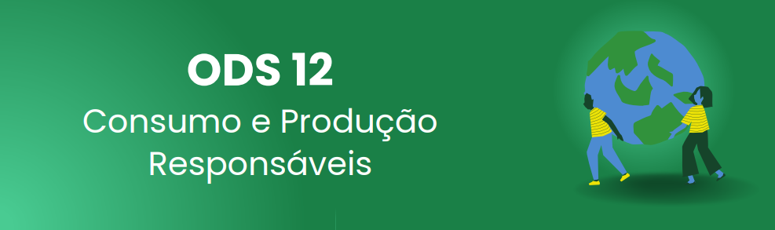

## 📗 Descrição do projeto

 <b>GreenEconomy</b> é um e-commerce que visa proporcionar para as pessoas o acesso a uma variedade de produtos sustentáveis.  
 
<strong>Mas não é só sobre produtos!</strong>
 

Temos o objetivo de incentivar as pessoas a adotarem práticas de <strong>consumo consciente</strong> e <strong>sustentável</strong>, assim dando prioridade a produtos que tenham um <strong>menor impacto ambiental</strong>.

Nosso projeto foi desenvolvido como parte do Bootcamp FullStack JS, promovido pela <strong>Generation Brasil</strong>, e tem como base um dos objetivos de desenvolvimento sustentável da <strong>ONU</strong>, a <strong>ODS 12</strong>.

 Para saber mais sobre a ODS 12 clique [aqui](https://brasil.un.org/pt-br/sdgs/12).
 

<table>
  <tr>
<h2 align="left">⚙️Linguagens & Tecnologias Utilizadas:</h2>

<h3>Linguagem</h3>

<h3>Back-end</h3>

<h3>Front-end</h3>

<h3> Outras Ferramentas</h3>

   

## ✅ Implementações Futuras
### Vem por aí...

  
 
🍃 Melhorias de Performance e SEO; 
🍃 Avaliações por comentários de clientes; 
🍃 Salvar produtos desejados; 
🍃 Melhoria na interface do dashboard de vendedor; 
🍃 Integração com API de pagamento; 
🍃 Autenticação com Google; 
🍃 Ajuste nos cargos de usuário; 
🍃 Aprimoramento na segurança. 

  
## 💚💻 Equipe de Desenvolvedores

<table>
  <tr>
    <td align="center"><a href="https://github.com/SenhorKaioh"> <b>Caio Pereira</b></a> </td>
    <td align="center"><a href="https://github.com/DEVnaoCry"> <b>Filipe Santiago</b></a> </td> 
    <td align="center"><a href="https://github.com/hrvieira"> <b>Henrique Vieira</b></a> </td> 
      <td align="center"><a href="https://github.com/Ind-ALL"> <b>Ingrid Alves</b></a> </td> 
     <td align="center"><a href="https://github.com/joycervs"> <b>Joyce Ramos</b></a> </td> 
    <td align="center"><a href="https://github.com/jorgeguedess"> <b>Jorge Guedes</b></a> </td> 
    <td align="center"><a href="https://github.com/Lucas-Ramires"> <b>Lucas Ramires</b></a> </td> 
    <td align="center"><a href="https://github.com/MariaBenitesJones"> <b>Maria Benites</b></a> </td> 
<td align="center"><a href="https://github.com/StephanieSST"> <b>Stephanie Steuernagel</b></a> </td> 

</table>

## 💚 Contate-nos
<h3>

[Nossos Links](https://linktr.ee/Greenconomy)
</h3>
